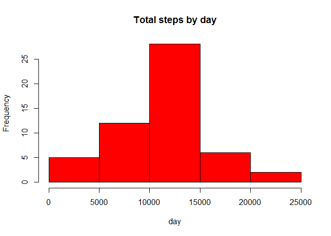
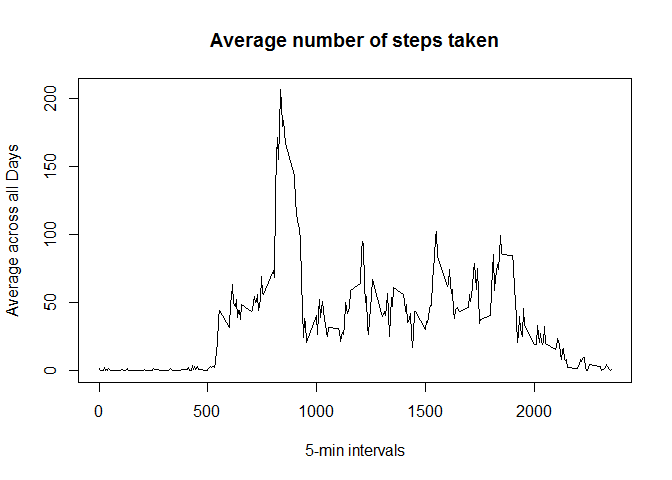
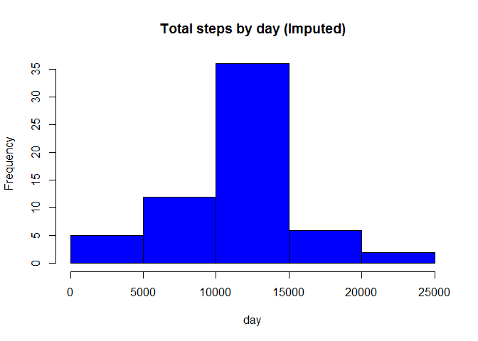

# Reproducible Research: Peer Assessment 1


Load required libraries and set appropriate flags

```r
library(knitr)
opts_chunk$set(echo = TRUE, results = 'hold')
library(data.table)
library(ggplot2)
library(Hmisc)
```

```
## Loading required package: grid
## Loading required package: lattice
## Loading required package: survival
## Loading required package: splines
## Loading required package: Formula
## 
## Attaching package: 'Hmisc'
## 
## The following objects are masked from 'package:base':
## 
##     format.pval, round.POSIXt, trunc.POSIXt, units
```


### Loading and preprocessing the data

1. Load the data (i.e. read.csv())
Extract zip file and read file. Set date column to be Date class and make interval column to be factor.

```r
if (!file.exists("activity.csv")) {
    unzip("activity.zip")
}
activity <- read.csv("activity.csv", colClasses=c("numeric", "character", "numeric"))
```

2. Process/transform the data (if necessary) into a format suitable for your analysis

```r
activity$date <- as.Date(activity$date, format = "%Y-%m-%d")
activity$interval <- as.factor(activity$interval)
```

Here is preview of final data in this step.

```r
str(activity)
```

```
## 'data.frame':	17568 obs. of  3 variables:
##  $ steps   : num  NA NA NA NA NA NA NA NA NA NA ...
##  $ date    : Date, format: "2012-10-01" "2012-10-01" ...
##  $ interval: Factor w/ 288 levels "0","5","10","15",..: 1 2 3 4 5 6 7 8 9 10 ...
```

### What is mean total number of steps taken per day?

1. Calculate the total number of steps taken per day

```r
totalStepsByDate <- aggregate(steps ~ date, data = activity, sum, na.rm = TRUE)
```

2. Make a histogram of the total number of steps taken each day

```r
hist(totalStepsByDate$steps, main = "Total steps by day", xlab = "day", col = "red")
```

 

3. Calculate and report the mean and median of the total number of steps taken per day
Mean of total number of steps by day is:

```r
mean(totalStepsByDate$steps)
```

```
## [1] 10766.19
```
Median of total number of steps by day is:

```r
median(totalStepsByDate$steps)
```

```
## [1] 10765
```

### What is the average daily activity pattern?

1. Make a time series plot (i.e. type = "l") of the 5-minute interval (x-axis) and the average number of steps taken, averaged across all days (y-axis)

We can calculate the mean steps for each five minute interval, and then put it in a array. Then we draw plot of that.

```r
stepsByInterval <- tapply(activity$steps, activity$interval, mean, na.rm = TRUE)
plot(row.names(stepsByInterval), stepsByInterval, type = "l", xlab = "5-min intervals", 
     ylab = "Average across all Days", main = "Average number of steps taken")
```

 

2. Which 5-minute interval, on average across all the days in the dataset, contains the maximum number of steps?

```r
maxInterval <- which.max(stepsByInterval)
names(maxInterval)
```

```
## [1] "835"
```

### Imputing missing values

1. Calculate and report the total number of missing values in the dataset (i.e. the total number of rows with NAs)


```r
missingValues <- sum(is.na(activity))
missingValues
```

```
## [1] 2304
```

2. Devise a strategy for filling in all of the missing values in the dataset. The strategy does not need to be sophisticated. For example, you could use the mean/median for that day, or the mean for that 5-minute interval, etc.

We will use different data frame "activityImputed"" for this purpose. For column "steps" in this new data frame we will use impute function from "Hmisc" package, that will impute mean values in place of NAs.

3. Create a new dataset that is equal to the original dataset but with the missing data filled in.


```r
activityImputed <- activity
activityImputed$steps <- impute(activity$steps, fun=mean)
```

4. Make a histogram of the total number of steps taken each day.


```r
totalStepsByDateImputed <- aggregate(steps ~ date, data = activityImputed, sum)
hist(totalStepsByDateImputed$steps, main = "Total steps by day (Imputed)", xlab = "day", col = "blue")
```

 

Calculate and report the mean and median total number of steps taken per day.
Mean (Imputed): 

```r
mean(totalStepsByDateImputed$steps)
```

```
## [1] 10766.19
```

Median (Imputed)

```r
median(totalStepsByDateImputed$steps)
```

```
## [1] 10766.19
```

Do these values differ from the estimates from the first part of the assignment? What is the impact of imputing missing data on the estimates of the total daily number of steps?

After replacing missing values, the mean is the same, but the median equals to the mean.

### Are there differences in activity patterns between weekdays and weekends?

1. Create a new factor variable in the dataset with two levels - "weekday" and "weekend" indicating whether a given date is a weekday or weekend day.


```r
day <- weekdays(activity$date)
daylevel <- vector()
for (i in 1:nrow(activity)) {
    if (day[i] == "Saturday") {
        daylevel[i] <- "Weekend"
    } else if (day[i] == "Sunday") {
        daylevel[i] <- "Weekend"
    } else {
        daylevel[i] <- "Weekday"
    }
}
activity$daylevel <- daylevel
activity$daylevel <- factor(activity$daylevel)

stepsByDay <- aggregate(steps ~ interval + daylevel, data = activity, mean)
names(stepsByDay) <- c("interval", "daylevel", "steps")
```

2. Make a panel plot containing a time series plot (i.e. type = "l") of the 5-minute interval (x-axis) and the average number of steps taken, averaged across all weekday days or weekend days (y-axis). See the README file in the GitHub repository to see an example of what this plot should look like using simulated data.


```r
xyplot(steps ~ interval | daylevel, stepsByDay, type = "l", layout = c(1, 2), 
    xlab = "Interval", ylab = "Number of steps")
```

 
